# ☀️ Solar - Gestor de Plantas Solares

**Proyecto DWEC** (Desarrollo de Aplicaciones Web en Entorno Cliente)

## 1. Requisitos Iniciales

**Repositorio del Profesor:** [https://github.com/xxjcaxx/exemples-dwec/tree/master/09-angular/2526/solar](https://github.com/xxjcaxx/exemples-dwec/tree/master/09-angular/2526/solar)

Objetivos iniciales:
- La base de datos será Supabase
- Utilizaremos el SDK de Supabase para autenticar, gestionar datos, imágenes y websockets
- RLS para los permisos de los clientes
- Se guardarán las plantas solares con ubicación y foto de forma que el instalador pueda darlas de alta con el móvil. La ubicación se obtiene de la API del navegador.
- Cada planta solar emite unos registros cada cierto tiempo que se guardan en la base de datos. Estos registros son de consumo y generación eléctrica.
- Se debe crear un usuario administrador que pueda gestionarlo todo (CRUD).
- Los usuarios clientes pueden ver sus plantas y los registros de las mismas.
- Cada planta tendrá una vista de detalle con la foto, los datos y una gráfica en tiempo real con websockets y alguna librería de gráficas.

**Formularios:**
- Formulario de plantilla para el buscador reactivo de plantas solares
- Formulario reactivo para el registro, login y perfil de usuario
- Signal Form para dar de alta y editar plantas solares
- Todos los formularios tendrán validación y se realizará al menos una validación personalizada

**Reactividad:**
- Los servicios utilizarán Observables y Subjects con pipe, también los websockets
- Los componentes y formularios utilizarán mayoritariamente Signals

**Componentes:**
- Los componentes obtendrán los datos por input() ya sea de componentes padres o de las rutas
- Los componentes hijos que tengan interacciones se comunicarán con los padres mediante output()
- Los componentes principales son los que se relacionan con los servicios, principalmente con Observables

**Ampliaciones:**
- Opcionalmente se mostrará un mapa con todas las plantas de todos los clientes o por cliente
- Se mantendrá el estado de la aplicación con Redux
- Se utilizarán componentes de Angular Material

> **Nota:** Finalmente, no se han implementado WebSockets en esta versión. Los datos se actualizan mediante consultas convencionales a la API de Supabase. La funcionalidad de tiempo real es una simulación.

---

## 2. Descripción General

**Lux Solar** es una aplicación web moderna para la gestión integral de plantas solares. Permite a administradores crear, actualizar y eliminar plantas solares con sus datos de ubicación y fotografías. Los usuarios clientes pueden visualizar sus plantas asignadas, consultar datos de generación y consumo eléctrico, y acceder a gráficas en tiempo real.

Características principales:
- ✅ Autenticación segura con Supabase Auth
- ✅ Gestión de plantas solares con ubicación GPS y fotografías
- ✅ Buscador reactivo en tiempo real
- ✅ Vista de mapa con todas las plantas
- ✅ Gráficas de consumo y generación eléctrica
- ✅ Sistema de roles (Admin/Cliente)
- ✅ Validación completa de formularios (Formularios de Plantilla, Reactive-Forms y Signal-Forms)
- ✅ Control de acceso basado en roles (RLS)
- ✅ Interfaz responsive y moderna

---

## 3. Tecnologías Utilizadas

| Tecnología | Uso |
|------------|-----|
| **Angular v21+** | Framework frontend moderno con Signals |
| **TypeScript** | Tipado estático |
| **Supabase** | Backend (auth, BD, storage) |
| **Signal Forms API** | Validación reactiva (Plantas CRUD) |
| **Reactive Forms** | Formularios Login, Register, Profile |
| **Template Forms** | Buscador (header) |
| **Leaflet.js** | Mapas interactivos |
| **Chart.js** | Gráficas de datos |
| **Bootstrap 5** | Framework CSS |
| **RxJS** | Programación reactiva |

---

## 4. Estructura del Proyecto

```
solar/
├── src/app/
│   ├── components/
│   │   ├── header/              → Buscador (Template Form)
│   │   ├── login/               → Reactive Form
│   │   ├── register/            → Reactive Form + validación
│   │   ├── profile/             → Reactive Form + badge rol
│   │   └── home/
│   │
│   ├── plantes/
│   │   ├── plantes-list/        → Búsqueda reactiva
│   │   ├── plantes-table/       → Signal Forms API
│   │   ├── plantes-detail/      → Gráficas
│   │   ├── plantes-map/         → Leaflet
│   │   └── plantes-item/
│   │
│   ├── services/
│   │   ├── supaservice.ts       → CRUD, auth, uploads
│   │   ├── busqueda.service.ts  → Búsqueda centralizada
│   │   └── guards/
│   │       ├── auth.guard.ts
│   │       └── admin.guard.ts
│   │
│   └── app.ts
│
├── public/imagenesDocu/         → 1.png - 16.png
└── README.md
```

---

## 5. Tipos de Formularios

### A) Reactive Forms (Login, Register, Profile)
- Validación granular
- Validadores personalizados
- Mensajes de error específicos

### B) Template Forms (Buscador Header)
- Binding simple con ngModel
- Bajo overhead
- Integración con Signals

### C) Signal Forms API (Plantas CRUD)
- API nativa Angular v21+
- Validadores signal-based
- Binding con [formField]
- Errores reactivos

---

## 6. Validaciones

✅ Validators.required, email, minLength
✅ Validador personalizado (passwordIguales en Register)
✅ Signal Forms validators (required, min)
✅ Mensajes inline bajo cada campo
✅ Estados (touched, invalid, pristine)

---

## 7. Roles de Usuario

**Administrador:** CRUD completo, gestión de usuarios
**Cliente:** Ver plantas asignadas, datos personales

---

## 8. Características Principales

- 🔐 Autenticación (Reactive Forms)
- 🌍 Geolocalización (navigator.geolocation)
- 📸 Upload de imágenes (Supabase Storage)
- 🔍 Búsqueda reactiva (Template Form)
- 📊 Gráficas (Chart.js)
- 🗺️ Mapa interactivo (Leaflet)
- ⚡ Control de acceso RLS

---

## 9. Metodologías Implementadas

**Angular v21+ Moderno:**
- ✅ Signals (no RxJS)
- ✅ @if, @for, @switch (no *ngIf, *ngFor)
- ✅ input(), output() (no @Input, @Output)
- ✅ ChangeDetectionStrategy.OnPush
- ✅ Signal Forms API

---

## 10. Paleta de Colores

Se ha apostado por un **degradado verde-azul-amarillo** que crea un contraste visual moderno y energético. El esquema combina colores naturales (verde para energía renovable) con tonalidades vibrantes que destacan elementos interactivos.

**Degradado Principal (Botones y Elementos Destacados):**
- 🟢 **Verde Éxito** (#198754): 35% - Base natural y confianza
- 🔵 **Azul Principal** (#0d6efd): 40% - Interactividad y profesionalismo
- 🟡 **Amarillo Solar** (#f1b24a): 25% - Energía y contraste solar

| Color | Código | Uso |
|-------|--------|-----|
| Amarillo Solar | #f1b24a | Acentos, icono perfil, energía |
| Azul Principal | #0d6efd | Botones, links, interactividad |
| Rojo | #dc3545 | Errores, eliminar, peligro |
| Verde | #198754 | Éxito, validación, energía renovable |
| Gris | #f8f9fa | Fondos, superficies neutras |

**Tema:** Claro con degradado solar verde-azul, ideal para aplicación de energías renovables

---

## 11. Instalación

```bash
npm install
ng serve
```

Acceder a `http://localhost:4200/`

---

## 12. Rutas

| Ruta | Guard | Acceso |
|------|-------|--------|
| `/login` | - | Público |
| `/register` | - | Público |
| `/profile` | auth | Autenticado |
| `/plantes` | auth | Autenticado |
| `/plantes_table` | admin | Admin |
| `/mapa` | auth | Autenticado |

---

## 13. Screenshots y Documentación Visual

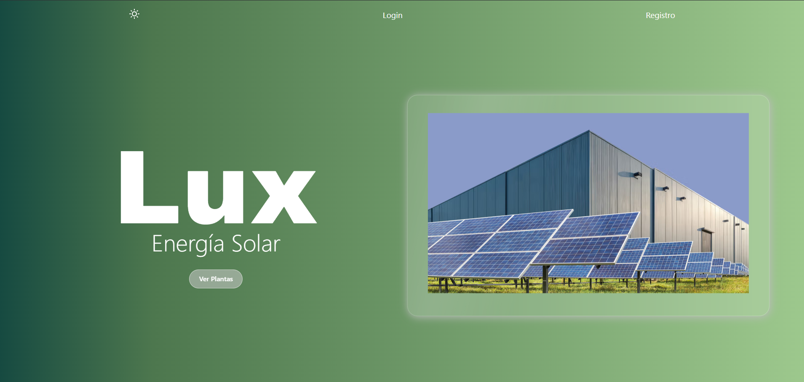
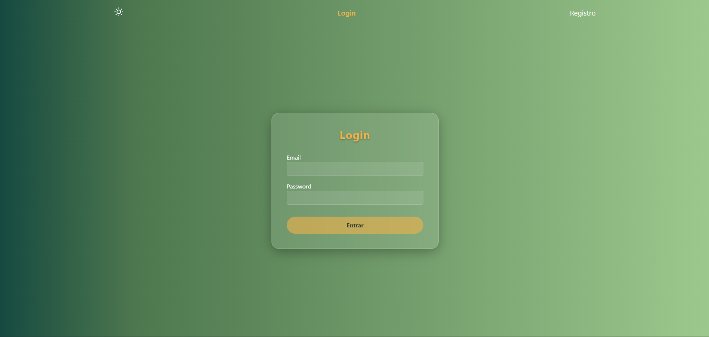
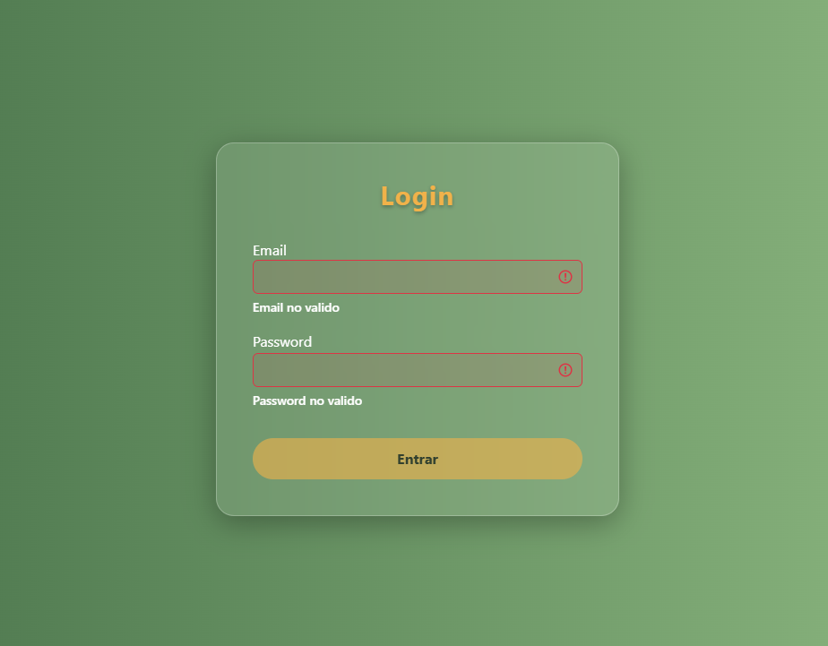
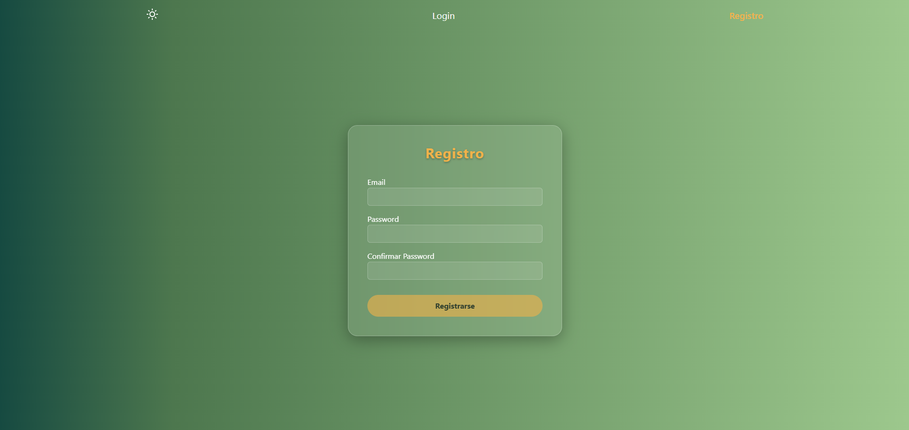

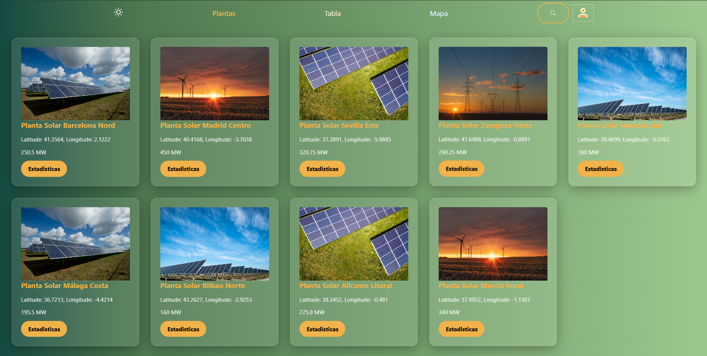
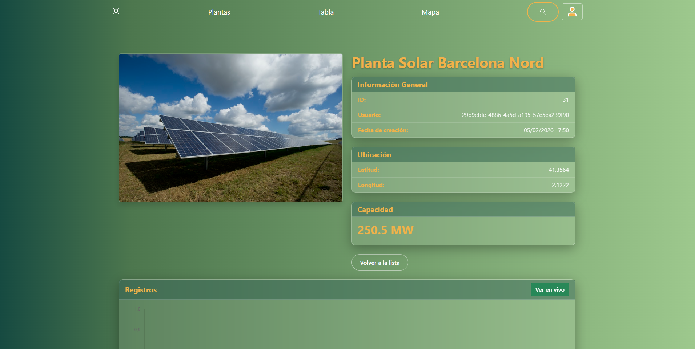

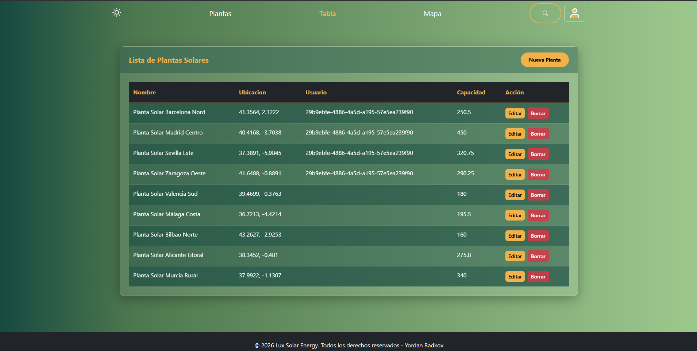
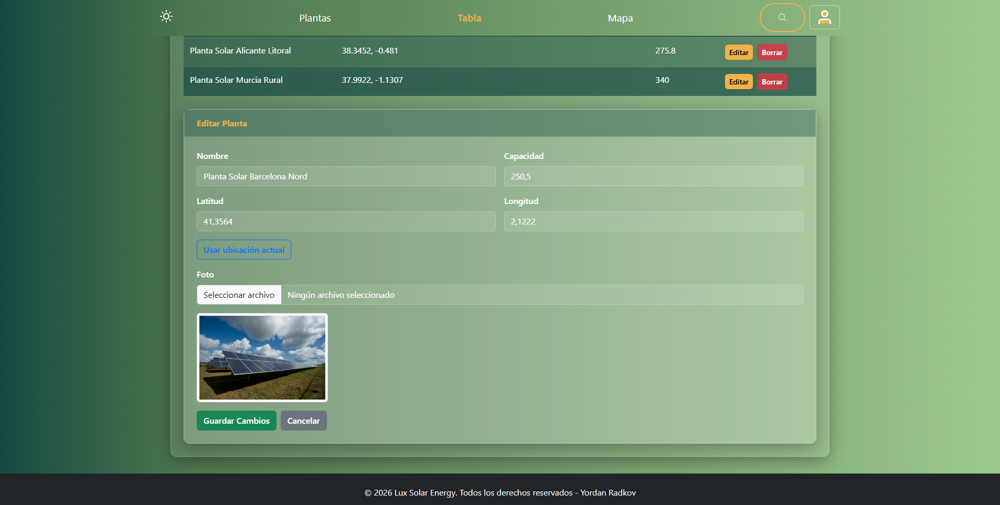
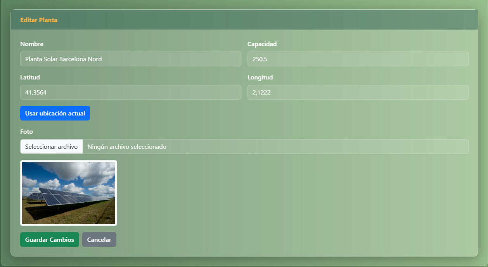
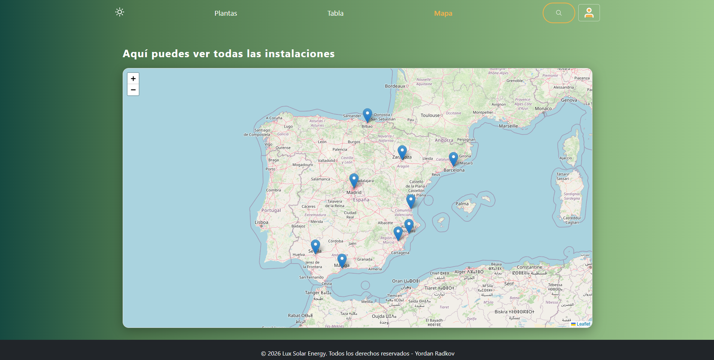
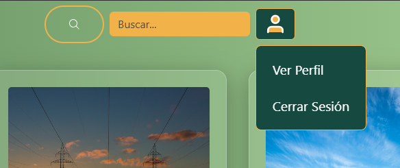
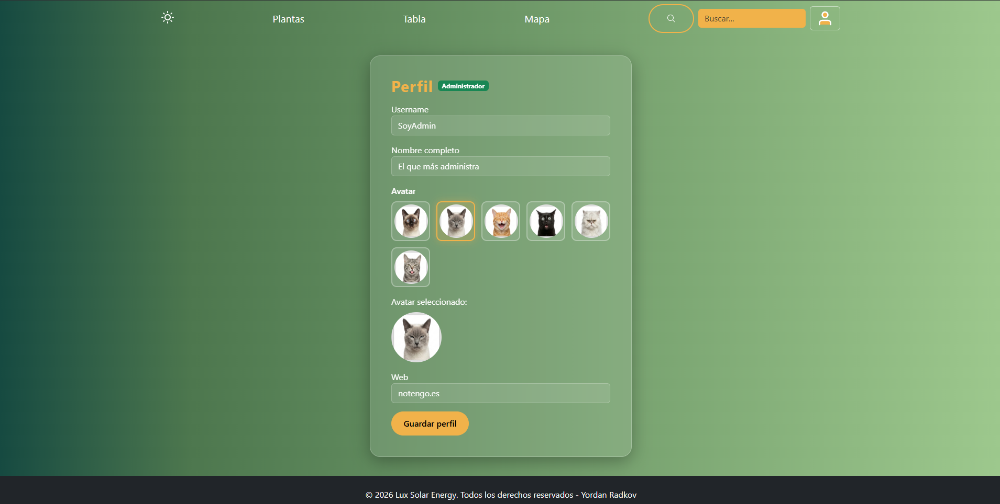
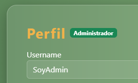
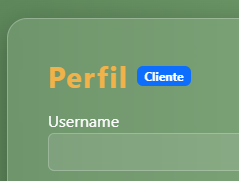

---

**Versión:** v1.0.0
**Proyecto DWEC:** Desarrollo de Aplicaciones Web en Entorno Cliente
**Última actualización:** Febrero 2026
